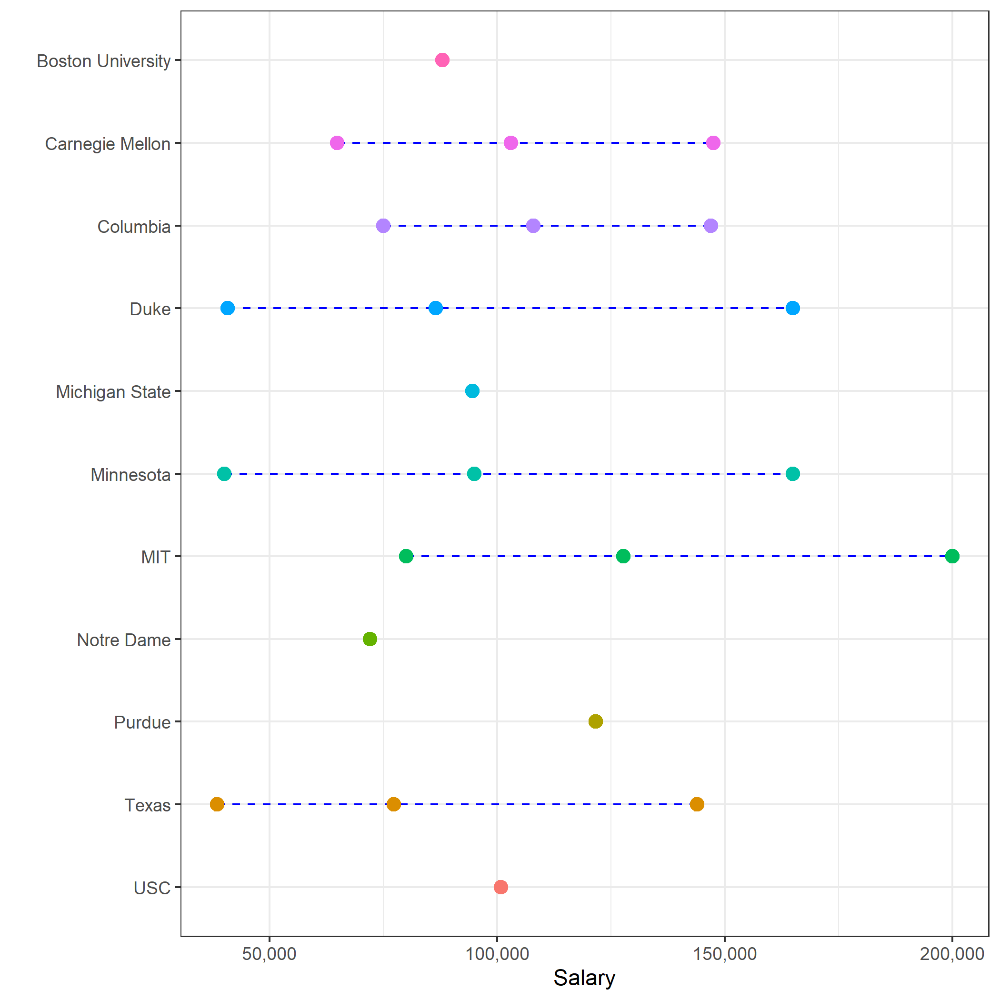

# Salary Expectations {-#salary-expectations}


```{r include=FALSE}
library(readr)
library(knitr)
library(ggplot2)
library(scales)
Other_Programs <- read_csv("assets/Other Programs.csv")
```


The below table details salary data from the other programs detailed in the previous section.  The figures presented are Minimum Salary, Average Salary, and Maximum Salary.  If only 1 point is presented then that stat is the Average Salary.


```{r echo=FALSE, warning = FALSE}
#commented it out.  manually saved png to images folder
 
 df <- as.data.frame(Other_Programs[c("School","SalaryMin","SalaryMax","SalaryAvg")])
 names(df)<- c("School","SalaryMin","SalaryMax","SalaryAvg")
 

 df$SalaryMin <- as.numeric(as.character(df$SalaryMin)) # Converts factor to numeric
 df$SalaryMax <- as.numeric(as.character(df$SalaryMax))
 df$SalaryAvg <- as.numeric(as.character(df$SalaryAvg))
 
 # used to flip x axis sorting
 df$School <- factor(df$School, levels=sort(df$School, decreasing = TRUE))
 
 P <- ggplot(df, aes(x=School, col = School))+
   geom_linerange(aes(ymin=SalaryMin,ymax=SalaryMax),linetype=2,color="blue")+
   geom_point(aes(y=SalaryMin),size=3)+
   geom_point(aes(y=SalaryMax),size=3)+
   geom_point(aes(y=SalaryAvg),size=3)+
   theme_bw()+
   ylab("Salary")+
   xlab("")+
   scale_y_continuous(label=comma)+
    theme(legend.position="none")+
   coord_flip()
 #ggsave("images/salary-plot.png")
 
```

