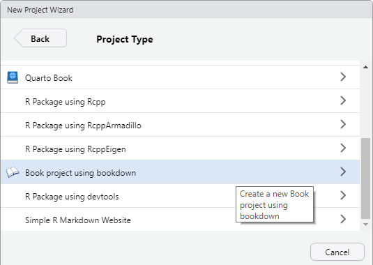
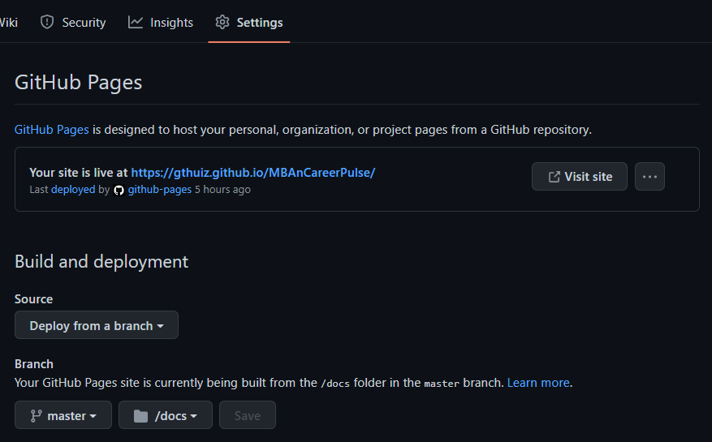

# Our Process {-#our-process}

Below we'll detail how we created this awesome website!

## Setting up bookdown project {-#setting-up-bookdown-project}

First we created a new project in R Studio and selected the Projected Type of "Book project using bookdown"

This template creates all the necessary files for creating the bookdown website.  In the _ouput.yml file we did change the bookdown type from a gitbook to bs4_book.  This change allows use to utilize a popular html framework called bootstrap.  Documentation for bootstrap can be found [here](https://getbootstrap.com/).  In general, the styling is much more appealing compared to gitbook and bootstrap is great for creating responsive pages that look great on mobile devices.

Here are some other resources related to setting up a bookdown project

[Bookdown and GitHub Pages setup](https://www.youtube.com/watch?v=RdSmYvbQkhs&ab_channel=GregoryMacfarlane)

[Cool help guide on bookdown styling](https://rstudio4edu.github.io/rstudio4edu-book/index.html)

[Good resource for bs4_book](https://bookdown.org/yihui/bookdown/html.html)

## GitHub {-#github}

After creating our local bookdown project we needed to add it to GitHub so our entire team could work on it.  We initialized a repository and added all of those files.  We committed those additions as an initial commit and pushed to GitHub.  After successfully pushing the files we were all able to connect and make commits going forward.

GitHub has a great feature called GitHub Pages which allows repositories to be displayed as a publicly accessible website.  On our _bookdown.yml file we specified that the HTML files generated that drive the site be dumped to a "docs" folder using the following code: output_dir: "docs".  When configuring GitHub Pages you can specify which directory the site will be built from. 

Our site was up and running at the [default url](https://gthuiz.github.io/MBAnCareerPulse/), and when we push to github those changes are automatically deployed to the site. Next, we were tasked with the more difficult job of adding content and making the site worth visiting.

## Content Sections {-#content-sections}

### About Us {-#about-us}

1. This section contains the introduction of our team members and our LinkedIn links if users want to contact our team members or learn more about us.

2. We built a csv file, uploaded it to our Google drive, and asked everyone to fill in the blanks. The contents are the following:
+ **Title**: Our names in alphabetical order.
+ **Text**: Brief introduction of ourselves. It contains our education background, our internship and working experience, and our vision in the future.
+ **Link**: Our LinkedIn personal URL so that users could see our member's personal file.
+ **Image**: Our member's photo stickers. All of us are very handsome, right?

3. After finishing our csv file, we would download it into our computer and use R language in R studio to let it read our file.

4. Finally, we would install package in "Build", commit, and push to the github.

### Potential Careers {-#potential-careers}

We chose five potential careers that are the most related to the BA program: Data Scientist, Data Engineer, Business Analyst, Data Analyst and BI Engineer. Each member on the team takes one career to do deep research. 

We created an excel to put all of the career information such as open roles, salaries and preferred skills in. This csv file will then be added to our resource. We then created a template to format and show each career clearly. This saved us a lot of time and lines of codes. Bootstrap cards are also used in this section for open roles which users are able to see it more clearly visually and have the links directly to the job website. 

### Other Programs {-#other-programs}

We chose around ten schools' BA programs which we believe are similar to our program. We found their curriculum, courses, tuition, ranking and other general information for the schools and employment data if there is any. We also put all these data into the csv file for us to change and insert easily. One feature we used in the R in this section is hide and unhide. This makes the website look clean and users can choose the schools they are interested on their own. The employment data for each school is also directly linked. 

### Salary Expectations {-#salary-expectations}

After compiling data on the other programs we wanted to create a visualization that showed the salary ranges for graduates from each school.  We stored that data in a csv file and loaded it to r as a data frame.  The columns are School, SalaryMin, SalaryMax, and SalaryAvg.  Not all of that data was available so for some schools we just show the average.

We used ggplot2 to create the plot.  [ggplot2](https://ggplot2.tidyverse.org/reference/ggplot.html) is a popular open-source data visualization package and we found it very easy to use.  We used geom_linerange() to create the line from the min to the max and geom_point() to add dots for each value.

### Company Database {-#company-database}

After gathering user stories one of the key changes we wanted to make was being able to show companies that were hiring data oriented positions by industry.  Rather than manually compiling this list we wanted to get the data from [glassdoor](https://www.glassdoor.com/) and to do that we created a webscapper. Our python project can be found [here](https://github.com/gthuiz/GlassdoorWebScraper) and it utilizes a python package called [https://www.selenium.dev/]() to loop through all the pages and select the proper HTML elements.  We pulled the top 50 companies for each of the 5 careers we detailed in earlier sections, totaling 250 records.

We loaded that data from a csv to r and stored it as a dataframe.  Then we displayed that dataframe on our page using a [datatable](https://rstudio.github.io/DT/) which is found in the DT package.  The search and filter capabilities are controlled by the button extensions which made it very easy for us to allow the user to filter by industry.

We modified the tutorial found [here](https://github.com/kelvinxuande/glassdoor-scraper) and this provides a good visual on the process if you are interested on you can build your own web scraper.

### Resources {-#resources}

1. This section contains the introduction of data processing skills and languages which are widely used in data analysis positions and useful links to learn them especially for beginners.

2. According to possible careers and MBAn curriculum, we understood the requirements and preferences of Business Analytics related positions. Then, we summarized some important programming and software skills which were Python, SQL, Excel, R, and other Business Intelligence Tools.

3. We wrote about each module in three parts:
+ **Summary**: Briefly introduce what is the skill and what does it use for.
+ **Customers**: The companies which extensively use such skill during their work.
+ **Ways to Learn**: We told how could they build the environment by downloading software and language package. Also, we recommended useful learning resources such as Coursera, YouTube, library, and documents.

4. To finish this section. We used some R Markdown Syntax:
+ Insert links in words or sentences: [words or sentences](links)
+ Bold subtitles: **subtitle**
+ Ballpoints: -

## Team Strategy {-#team-strategy}

We are the 007 Wolverines

### Handling Changes and Conflict {-#handling-changes-and-conflict}

we used class content

### Dividing Work {-#dividing-work}

Our team was able to finalize the website structure and different sections we want to include very early. This allowed us to have the project timeline ready very early, too. Basically for each week, our week focused on completing on section. Inside the section, we divided our work either at the team meeting or sign up on a separate spreadsheet. Luckily, all of our team members kept up with the deadline very well. We reminded and helped each other for any technical or research difficulties. Therefore, an additional section was required by Sanjeev at the end of the semester, we managed to push the deadline a little bit early and finished the whole project on time.

### Agile {-#agile}

* Before we hold a meeting, we would briefly introduce the main purpose, some bull-points, and some points of note of the meeting. If it involves our previous work, we will check if everyone has done. Also, we check everyone's schedule to ensure everyone could attend the meeting. We need to increase the participation rate and let all members understand our project and process comprehensively to narrow the information gap so we could push our project with great efficiency.

* During the meeting, everyone is welcomed to express their opinions and exchange ideas. When someone is talking about our project, others are listening to him carefully and respectfully. For someone giving thoughtful ideas, we show high recommendation to him. If he ignores something, we would remind him instead of blaming him. We maintain a healthy and positive atmosphere in our team so that everyone feels comfortable in the team.

* At the end of the meeting, our leader quickly makes the decision about our next step, what we should do, and our deadline of our tasks. Because of fully preparation before the meeting and active discussion during the meeting, we easily come to agreement so that we could speed up our decision process and leave time for feedback.

* Not only do we focus on our project, but we pay attention to personal development. Our team leader always teaches us some useful tools in R Markdown and how to use them.

## Final Thoughts {-#final-thoughts}

* Overall we all believe this is an excellent team project experience. Grant is very experienced in doing this type of work and he has been a great team leader. Everybody else has also been learning so much from him as well as finishing his own work efficiently. This is a valuable lesson for each of us to gain some new skills by working on a team programming project. 

* In the remaining time, all we have left is the final presentation for this project. This is an exciting time for us to share what we created and how other students could use it as a helpful resource in the future. We will keep using our team operation strategy to prepare for the presentation. We will also try to change things we hoped to improve according to the mid point report. All in all, we want to finish this semester strongly with the presentation.